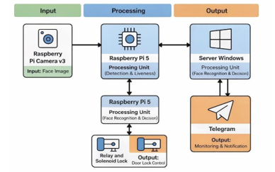
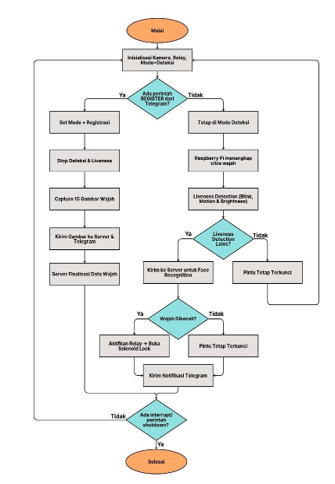
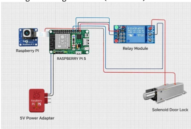

# IoT SmartDoor – Face Recognition & Liveness Detection System

## Overview

IoT SmartDoor is an intelligent door security system that combines **edge computing**, **computer vision**, and **server-based face recognition** to provide secure and contactless access control.

The system uses a **Raspberry Pi** as the edge device for real-time camera processing and liveness detection, while a separate server handles face embedding verification and user recognition. The door lock is controlled automatically based on authentication results, with real-time notifications delivered via Telegram.

This project was developed as an IoT-based smart security prototype integrating hardware, software, and network communication.

---

## System Architecture



### Architecture Summary

* **Raspberry Pi (Edge Device)**

  * Camera capture
  * Face detection
  * Liveness detection
  * Communication with server
  * Door lock control

* **Server**

  * Face embedding processing
  * Recognition and validation
  * Data management
  * Notification handling

* **User Interaction**

  * Telegram Bot for notifications and registration

---

## System Workflow



### Process Flow

1. Camera captures face image.
2. Liveness detection verifies real human presence.
3. If liveness passes → image sent to server.
4. Server performs face recognition using embeddings.
5. Recognition result returned to Raspberry Pi.
6. Door unlocks automatically if user is valid.
7. Telegram notification sent to user.

---

## Hardware Design



### Hardware Components

* Raspberry Pi 5
* Raspberry Pi Camera Module
* Relay Module
* Solenoid Door Lock
* Power Supply
* Server (Windows/Linux)

---

## Telegram Notification Example


The system sends real-time notifications for:

* Successful access
* Unknown face detection
* Failed liveness detection

---

## Project Structure

```
iot-smartdoor-liveness-detection/
│
├── raspberry_pi/
│   ├── main.py
│   ├── liveness_detection.py
│   ├── lock_controller.py
│   ├── register.py
│   ├── stream_server.py
│   └── requirements.txt
│
├── server/
│   ├── server.py
│   ├── notifier.py
│   ├── bot_module.py
│   ├── make_embeddings.py
│   ├── spoof_detector.py
│   └── smartdoor_windows_requirements.txt
│
├── models/
│   └── haarcascade_frontalface_default.xml
│
├── docs/
│   ├── system_block_diagram.png
│   ├── system_flowchart.png
│   ├── hardware_design.png
│   └── telegram_notification.png
│
└── README.md
```

---

## Key Features

* Face recognition-based access system
* Liveness detection (anti-spoofing)
* Edge computing using Raspberry Pi
* Client–server architecture
* Automatic door lock control
* Telegram Bot integration
* Real-time system monitoring

---

## Technology Stack

* Python
* OpenCV
* dlib (Face Embedding)
* Flask REST API
* Raspberry Pi GPIO
* Telegram Bot API

---

## Installation (Basic)

### Raspberry Pi

```
pip install -r requirements.txt
python main.py
```

### Server

```
pip install -r smartdoor_windows_requirements.txt
python server.py
```

---

## Notes

* Face embeddings are generated automatically during runtime.
* Logs and generated data are excluded from the repository.
* This repository focuses on system architecture and core implementation.

---

## Author

**Said Hasan Al Musthafa**
Applied Telecommunications Engineering
Politeknik Negeri Padang

## Demo

System demonstration includes:

- Face detection & liveness validation
- Server-side recognition
- Automatic lock control
- Telegram notification delivery

